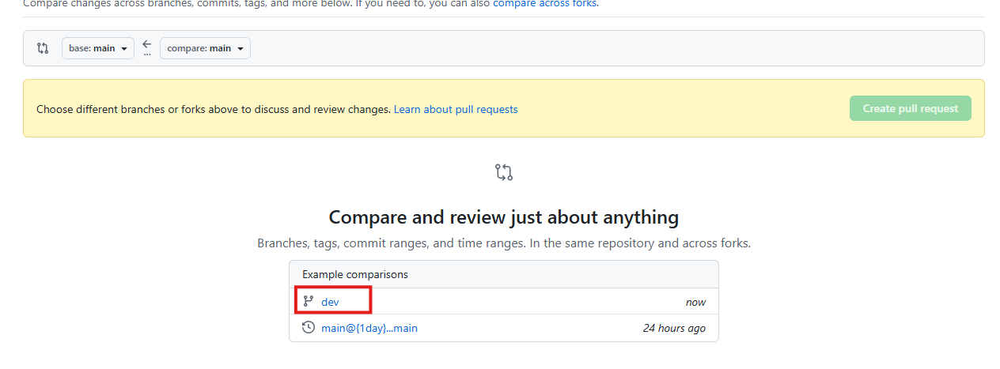

# 🚀 Introducción

Este laboratorio está diseñado como una introducción práctica a Git, una herramienta fundamental para el control de versiones en el desarrollo de software. A lo largo de este ejercicio, aprenderás los conceptos básicos para gestionar código, crear y trabajar con repositorios, realizar commits y colaborar mediante ramas.

El objetivo es brindar una base sólida que te permita comenzar a trabajar con flujos de desarrollo modernos y comprender cómo se gestionan los cambios en proyectos reales

# 📙 Instrucciones
#### Como requerimientos previos se necesita tener instalado git en tu pc, una cuenta en github y visual studio code para poder editar el archivo index.html.
Esta guia de laboratorio solo explicara ejecucion de comandos mediante CLI.


## 1. Creación de un repositorio.

- Cuando se este logueado en github ir a Perfil -> Repositories.

- Seleccionar New

- Se desplegara el siguiente menu para poder crear el repositorio, Poner como nombre del repositorio laboratorio_github y crearlo


## 2. Descarga de archivos para laboratorio en tu propio repositorio.

En este caso no se usara la funcion Fork de git para evitar posibles conflictos con el repositorio principal por algun PR.

Ubicate en la carpeta o sitio donde quieres clonar el repositorio que creaste, abre la ventana de comandos o terminal de tu preferencia y ejecuta los siguientes comandos:
```bash
  git clone https://github.com/mnarvaezm96/lab_github.git
  cd lab_github
  git remote remove origin
```
### IMPORTANTE
Para ejecutar el siguiente comando se tiene que cambiar "tu-usuario" por el nombre de tu usuario github. 
```bash
  git remote add origin https://github.com/tu-usuario/laboratorio_github.git
  git push -u origin main
```
Luego de ejecutado los comandos se puede verificar en github que ya se han agregado archivos.

## 3. Configuracion de pagina estatica para el laboratorio.

Para este laboratorio se requiere habilitar una configuracion en el repositorio que me permita revisar los cambios en el archivo de index.html en el navegador web de forma publica, para esto seguir los siguientes pasos:
- Dirigirse a Settings desde el repositorio. 
- Seleccionar la seccion de Pages y en Build and deployment desplegar la barra y seleccionar GitHub Actions. 

Ya con las configuraciones realizadas se puede a proceder con ejecucion de comandos git para el laboratorio.

## 4. Creación de ramas con git.

Para crear un rama en con git se debe estar primero ubicado en la rama a la que quieres aplicar modificaciones, en este caso solo esta creada la rama main por lo que crearemos la rama "dev"

Para verificar en que rama se esta ubicado mediante la CLI se ejecuta el comando
```bash
    git branch
```
para checar que ramas remotas tiene el repositorio en github se utiliza
```bash
    git branch --all
```
Este comando es util para saber si el repositorio en internet tiene mas ramas y no las puedes evidenciar en el repositorio clonado localmente.

Una vez corroboramos que estamos en la rama main podemos crear la rama dev con el comando:

```bash
    git switch -c dev
```
cuando se ejecute este comando se puede corroborar con los comandos anteriores que ya se cuenta con la rama creada localmente, pero no esta aun creada en el repostorio alojado en internet, para poder crear esta rama en el repositorio alojado en internet se ejecuta el siguiente comando:
```bash
    git push origin dev
```
Como se puede apreciar cuando se va a hacer push hacia el repostorio en internet se especifica "origin <nombre-de-la-rama>".

### Ahora puedes modificar el codigo en la rama de desarrollo sin afectar la rama de produccion (main)

#### para modificar el codigo necesitamos abrir el Visual Studio Code y abrimos el proyecto (File -> Open Folder -> lab_gitlab). Nos deberia quedar como nos muestra en la imagen.  

#### Para ver el proyecto por web debemos ingresar al gestor de archivo entramos a la ruta donde está el proyecto y copiamos esa url que aparece seleccionada.  

#### Luego, vamos al navegador y copiamos la ruta y al final le agregamos \index.html para que lo visualicemos como se ve en la imagen.  

#### Vamos a realizar variamos modificaciones dentro del codigo: 

#### 1. Se cambia el color del header colocando el cursor en el color donde esta seleccionado 

#### 2. Se cambia el titulo del header en la ruta 86 y se pone el nombre que quisiera. 


#### Nota: Si desea realizar cambios adicionales en el codigo es completamente libre.


## 5. Subir cambios al repositorio

Luego de que se hallan modificado archivos y se hallan guardado se puede ejecutar el comando
```bash
    git status
```
para poder visualizar que archivos han sido modificados, para agregar estos archivos al staging (Un área intermedia donde preparas los cambios antes de guardarlos definitivamente)
se utiliza el comando
```bash
    git add <nombre-archivo-modificado-1> <nombre-archivo-modificado-2> <nombre-archivo-modificado-3>....
  #Cada archivo diferente que se vaya a agregar al staging va separado por espacios
```
Al ejecutar el comando y volver a verificar con "git status" se puede apreciar que los archivos quedaron almacenados para poder lanzarsen en el siguiente commit (guardar una versión del código con un mensaje).

Ahora se crea el commit que se lanzara al repositorio agregando los cambios realizados en los archivos modificados en la rama dev.

```bash
    git commit -m "mi primer commit"
```
Una vez creado el registro del commit localmente ya se pueden aplicar los cambios en el repositorio utilizando el comando:
```bash
    git push origin dev
```
### Ahora en el repositorio se puede ver los cambios que hiciste a los archivos junto el mensaje del commit que realizaste


## 6.Aplicar cambios de una rama a otra.

Para aplicar cambios de una rama a otra de forma facil y llevando un registro de historico de commits se utiliza el comando "merge".

Luego de que se realizan cambios en los archivos de la rama dev requiero traermelos para mi rama main, para poder realizar esta accion se requiere primero cambiar a la rama main, para hacer el cambio se utiliza el comando.

```bash
    git switch main
```

### Importante:
el comando de "git switch" se le pueden agregar flags para variar sus acciones, en este caso no se le agrega ninguna flag (-c,-D,etc...) utilizandolo sin flags me permite cambiar entre ramas.

Una vez se halla cambiado de rama y corroborar con el comando "git branch" que se esta en main se puede utilizar Ahora merge:
```bash
    git merge dev
```
### El comando se puede interpretar de la siguiente forma
la rama actual donde estoy ubicado (main) ----> desea traer los cambios de la rama dev

Luego de ejecutado el comando no hay que realizar ningun "git add" o "git commit" ya que el merge lo que hace es traer todos los cambios que se realizaron en la rama dev, solo quedaria aplicar el siguiente comando:
```bash
    git push origin main
```
## Ahora puedes ver los cambios que hiciste en la rama dev en la rama main.

## 7. Aplicar merge solicitando Pull Request (PR)
### Para este paso no hay que repetir el paso 6 ya que es un proceso diferente para poder realizar el PR.

Para implementar un merge a la rama main mediante pull request, se requiere traer los cambios de la rama dev a main a traves de la consola de github, en muchos casos en los repositorios de codigo bloquean el push directo a rama main o trunk y solicitan un PR de un tercero, para poder generar el PR de tu ultimo cambio realizado en dev o tu rama feature o de fix se hace lo siguiente:

Luego de haber realizado el push directo a la rama dev en github hacer los siguientes pasos
- ir a Pull Requests 
- Seleccionar New Pull request 
- Seleccionar la rama dev 